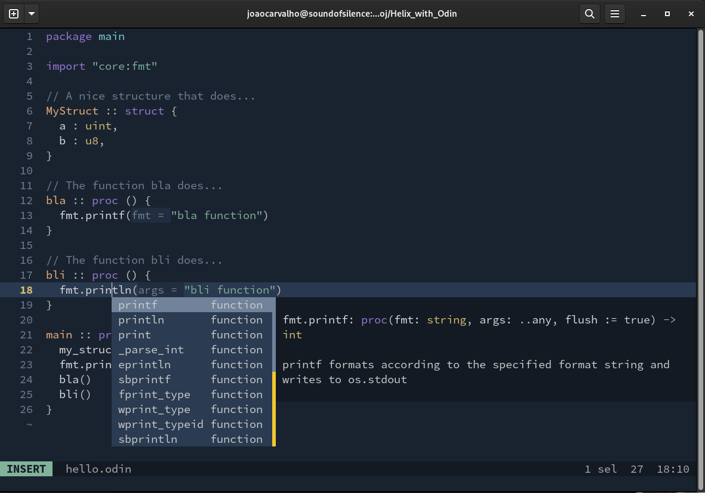
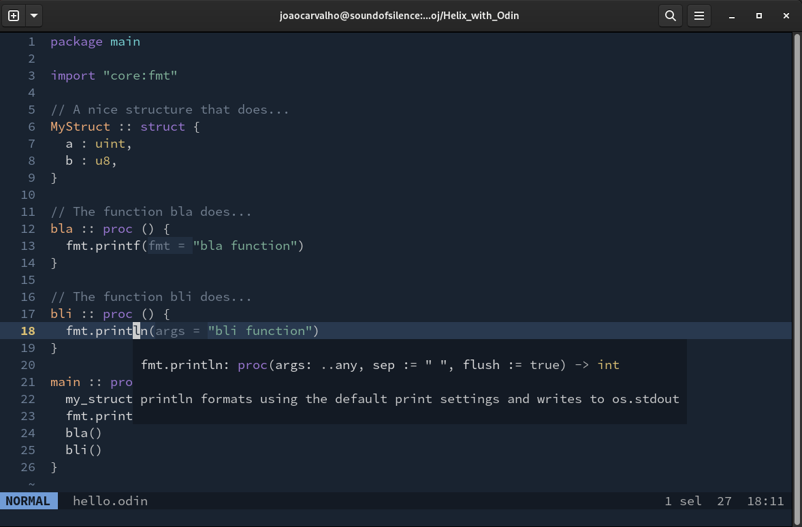
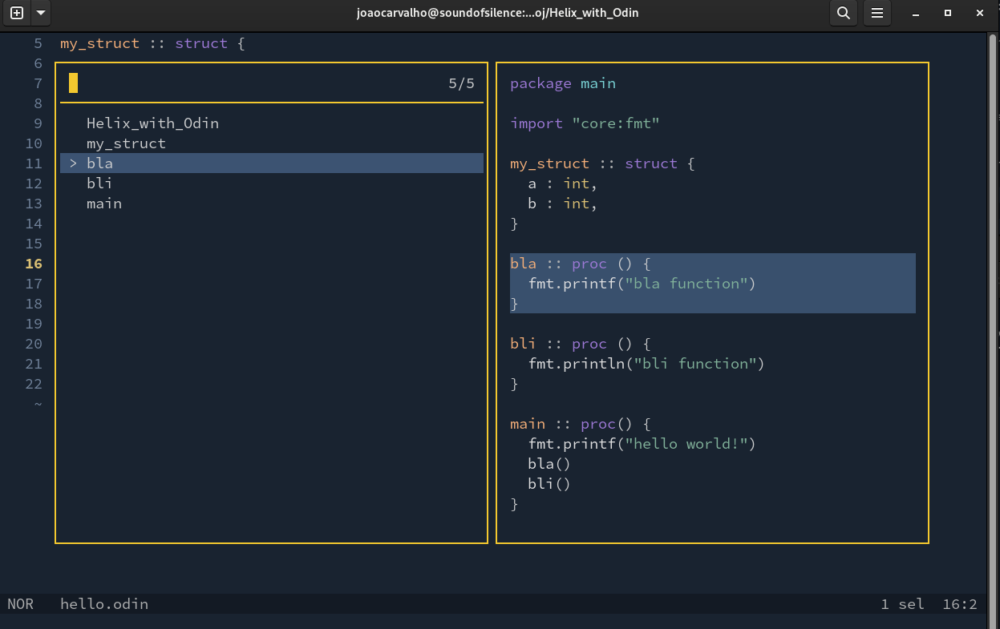
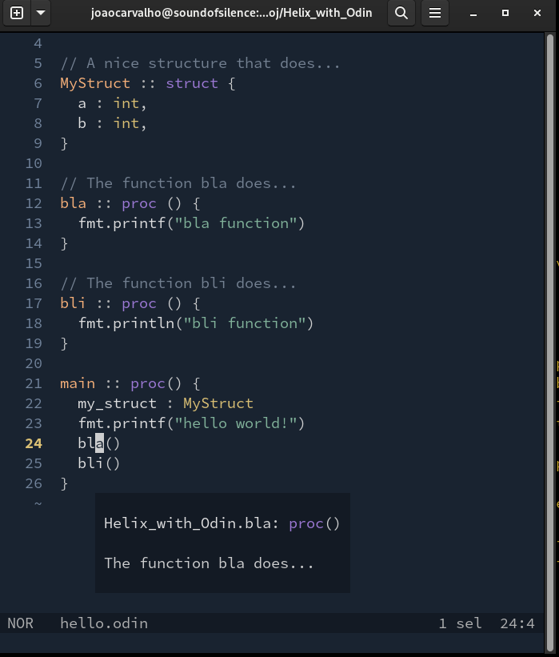
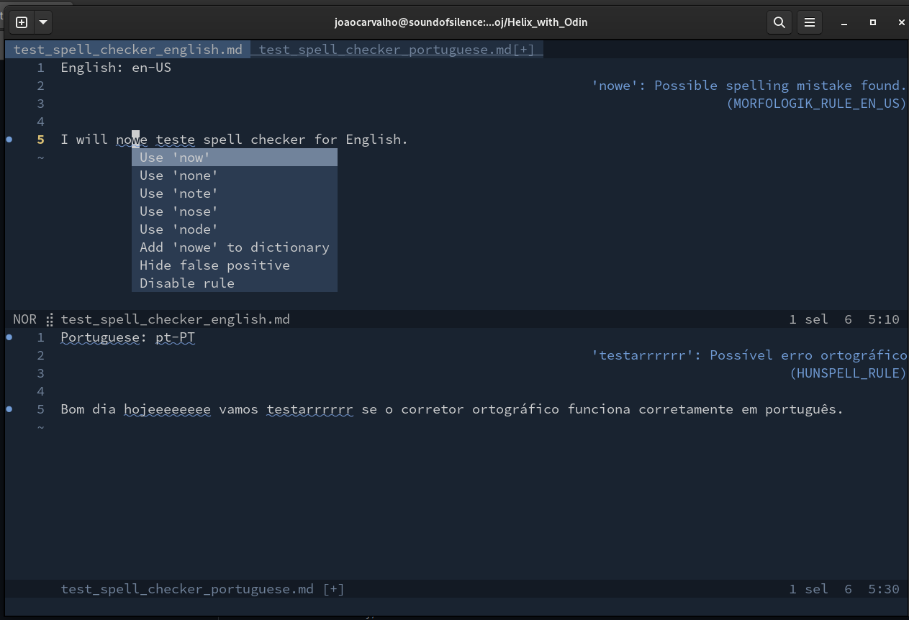
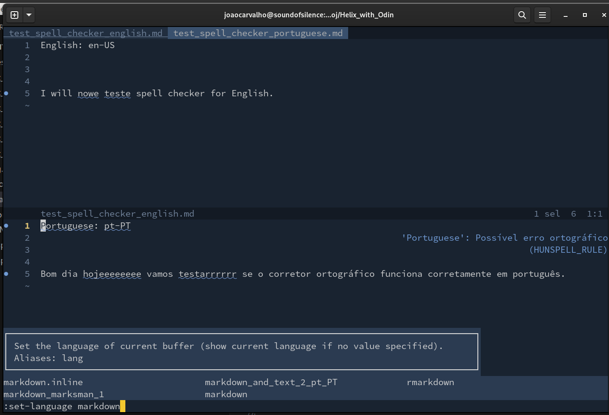

# Helix editor for Odin programming Language
How to configure and simple manual regarding Odin.

## Description
Helix is a great little editor, like VIM or NeoVIM, that's also mode based, but that doesn't use the key bindings of VIM, it follows the key bindings of Kakoune.
There are also Kakoune key bindings for VSCode. <br>
As a personal opinion, I prefer the Helix key bindings and modes to the VIM keys, but that is only a personal opinion. Helix is made in Rust and it is a really fast editor.

## Helix installation
To install Helix on openSUSE do.

``` bash
sudo zypper install helix
```

## OLS - Odin Language Server LSP
1. To install OLS in openSUSE, you need to go to the Odin page and read the installer and to go from there to the GitHub and download the repository or clone it, if you have git installed. Put in a directory like ```/home/username/odin/``` then install the prerequisites, current versions use the LLVM17. Compile it and put it on the path. <br> 
[http://odin-lang.org](http://odin-lang.org) <br>
[https://github.com/odin-lang/Odin](https://github.com/odin-lang/Odin)

2. Then you have to go the OLS GitHub repository and download it to a directory. [https://github.com/DanielGavin/ols](https://github.com/DanielGavin/ols) , you have to download it and compile it. Then follow its instruction to put in your path.

3. Install the Marksman - Markdown LSP - Language Server. [https://github.com/artempyanykh/marksman](https://github.com/artempyanykh/marksman) also for openSUSE <br>

``` bash
sudo snap install marksman
```

4. Then you have to create a file config.toml and save it to ```~/.config/helix/config.toml``` with the following content. To add a cool theme and the text wrapper for txt and markdown files. <br>

``` toml

theme = "nightfox"

[editor]
bufferline = "always"
# Whether to apply completion item instantly when selected.
preview-completion-insert = false

[editor.soft-wrap]
enable = true
max-wrap = 80 # increase value to reduce forced mid-word wrapping
max-indent-retain = 0
wrap-indicator = ""  # set wrap-indicator to "" to hide it

[editor.cursor-shape]
insert = "bar"
normal = "block"
select = "underline"

[editor.statusline]
left = ["mode", "spinner", "file-name", "read-only-indicator", "file-modification-indicator"]
right = ["diagnostics", "selections", "register", "total-line-numbers", "position", "file-encoding"]

```   

5. Install the LTXT-LS LSP language server for natural languages spell checking, in a directory on your local user, example: ```/home/joaocarvalho/ltxt-ls/``` . Download from [github - ltxt-ls](https://valentjn.github.io/ltex/ltex-ls/installation.html), if you have difficulties see this article that I also sow [Jens Getreu - Note talking with Helix, Tp-Note and LanguageTool](https://blog.getreu.net/20220828-tp-note-new8/)  <br>

   Edit the path in the next file for the two instances of command that will call the same LTXT-LS LSP program.


6. Then you have to add a file languages.toml to the ```~/.config/helix/languages.toml``` , with the following content. This will configure the Odin OLS server and tree-sitter syntax highlighting for Odin and the Markdown Marksman OLS and syntax highlighting. <br> 

``` toml

[language-server]
ols      = { command = "ols", args = [] }
marksman = { command = "marksman", args = ["server"] }


[[language]]
name = "odin"
#auto-format = false
scope = "scope.odin" # "source.odin"
file-types = ["odin"]
roots = ["ols.json"]
language-servers = [ "ols" ]
comment-token = "//"
indent = { tab-width = 2, unit = " " }
injection-regex = "odin"
formatter = { command = "odinfmt", args = [ "-stdin", "true" ] }


[[grammar]]
name = "odin"
#source = { git = "https://github.com/ap29600/tree-sitter-odin", rev = "b219207e49ffca2952529d33e94ed63b1b75c4f1" }
source = { git = "https://github.com/amaanq/tree-sitter-odin" }


[[language]]
name = "markdown_marksman_1"
scope = "source.md"
injection-regex = "md|markdown"
file-types = ["md", "markdown", "PULLREQ_EDITMSG", "mkd", "mdwn", "mdown", "markdn", "mdtxt", "mdtext", "workbook"]
roots = [".marksman.toml"]
language-servers = [ "marksman" ]
indent = { tab-width = 2, unit = "  " }


[[grammar]]
name = "markdown"
source = { git = "https://github.com/MDeiml/tree-sitter-markdown", rev = "aaf76797aa8ecd9a5e78e0ec3681941de6c945ee", subpath = "tree-sitter-markdown" }


[[language]]
name = "markdown_and_text_2_pt_PT"
language-servers = [{ name = "ltex_pt"}]
file-types = ["md", "txt"]
scope = "text.markdown"
roots = []

[language-server.ltex_pt]
command = "/home/joaocarvalho/ltxt-ls/ltex-ls-16.0.0/bin/ltex-ls"

[language-server.ltex_pt.config.ltex]
language = "pt-PT"
# language = "en-US"

[language-server.ltex_pt.config.ltex.dictionary]
"en-PT" = ["VScode", "NeoVim", "Vim", "Emacs"]


[[grammar]]
name = "markdown"
source = { git = "https://github.com/MDeiml/tree-sitter-markdown", rev = "aaf76797aa8ecd9a5e78e0ec3681941de6c945ee", subpath = "tree-sitter-markdown" }


# markdown_and_text_3_en_US
[[language]]
name = "markdown"
language-servers = [{ name = "ltex_us"}]
file-types = ["md", "txt"]
scope = "text.markdown"
roots = []

[language-server.ltex_us]
command = "/home/joaocarvalho/ltxt-ls/ltex-ls-16.0.0/bin/ltex-ls"

[language-server.ltex_us.config.ltex]
language = "en-US"
# language = "en-PT"

[language-server.ltex_us.config.ltex.dictionary]
"en-US" = ["VScode", "NeoVim", "Vim", "Emacs"]


[[grammar]]
name = "markdown"
source = { git = "https://github.com/MDeiml/tree-sitter-markdown", rev = "aaf76797aa8ecd9a5e78e0ec3681941de6c945ee", subpath = "tree-sitter-markdown" }

``` 

7. Run Helix with the health option to see what is currently installed and supported on you machine.

``` bash
helix --health

or

hx --health
``` 

8. Run Helix normally.


``` bash
helix

or

hx
``` 

9. Then run the Helix tutor.

``` bash
helix
:tutor    <- inside Helix in normal mode.

and do SPACE + "?" to see all the commands and find what you want with fuzzy search.
```

10. If this configuration doesn't work for same unknown reason you should go to the Helix github, language configuration file and search for OLS and Marksdown and see what changed there. Mine version has some minor but important changes to the original. <br>

[https://github.com/helix-editor/helix/blob/master/languages.toml](https://github.com/helix-editor/helix/blob/master/languages.toml)

<br>

11. To set the language (language server) for Markdown or text, in Helix for each buffer do. <br>

```
// For English spell checker.

:set-language markdown
```

<br>

```
// For Portuguese spell checker.

:set-language markdown_and_text_2_pt_PT
```

<br>

```
// For Markdown Marksman no spell checker.

:set-language markdown_marksman
```


<br>

Code completion with docs. Appear automatically or in Insert mode, make CTRL + x .<br>
 <br>

Function arguments doc. <br>
 <br>

Symbols list with fuzzy search to jump to. CTRL + s for file scope or CTRL + S for workspace scope. <br>
 <br>

Documentation on symbol, SPACE + k . <br>
 <br>

Spell checking in two txt or markdown files one in English and one in Portuguese. CTRL + a to see the popup with the correct spell. <br>
 <br>

How to set the correct dictionary for the selected document, it has the TAB or CTRL + i completion. <br>
 <br>


Don't forget that you have to have a ols.json file inside your project directory to point to the correct project directory and to Odin.

## Simple manual to navigate in Odin files with Helix

One can navigate in a tree like way, over all the functions, from the original reference call function, to the declaration of that function and back again up the tree to the original call. This can be several levels deep, and you can go one level down, a second level down and one up and other function down, in a tree like style. 

### Here's how to do it

``` odin
package main

import "core:fmt"

bli :: proc( ) {
    fmt.printf("bli")
}

blo :: proc( ) {
    fmt.printf("blo")
}

bla :: proc( ) {
    fmt.printf("bla")
    bli( )
    blo( )
}

main :: proc() {
    bla()
}
```

1. In main, go over the call of the function name bla() with the keyboard moves.
2. Type g + d  for **go to declaration**. One level down.
3. Go over the function name bli() inside that function bla() with the keyboard moves.
4. Type g + d  for **go to declaration**, again. One level down.
5. Then to **go up one level** do CTRL + o  for jump to previous jumplist.
6. Go over the function name blo() inside that function bla()  with the keyboard moves.
7. Type g + d  for **go to declaration**, again. One level down.
8. Then to **go up one level** do CTRL + o  for jump to previous jumplist.
9. Then to **go up one level** do CTRL + o  for jump to previous jumplist.
10. Now, you are again at the original call to bla().
11. Then **you can jump in the jumplist sequence** by doing TAB or CTRL + i (for ctrl in) CTRL + o (for ctrl out) in the jumplist.

There is also a real useful feature in Helix editor, that is **go to references** when you are over a word, but OLS has not implemented that feature yet, I checked and VSCode also doesn't have this feature yet. <br>

There is also the possibility of **jumping directly to function symbols** with Space + s for **Open symbol file list**, and Space + S for **Open Workspace symbol file list**, and you have fuzzy finding inside the list of symbols with a previous of each symbol on the right, that you can change with the arrows down and up. 

### Format the Odin file
To format the Odin file simply do.

```
:fmt
```
 
## Conclusion
All in all for editing Odin files the Helix editor is pretty nice! And is much simpler to configure then EMACS, or NeoVIM, and the keys of Helix are also pretty nice also, more intuitive than VIM Keys. There are some key binding for the Kakoune, I believe it is spelled like that, key map, for VSCode. There is also a tutor for Helix, like there is in VIM. <br>

Some of the current things that are lacking on Helix are:
- Plugin system.
- Plugin for Copilot.
- --Plugin for spell checking-- With this configuration I manage to make it work, even in two natural languages, English and Portuguese. 

## License
Creative Commons License

## Have fun
Best regards, <br>
Joao Carvalho
